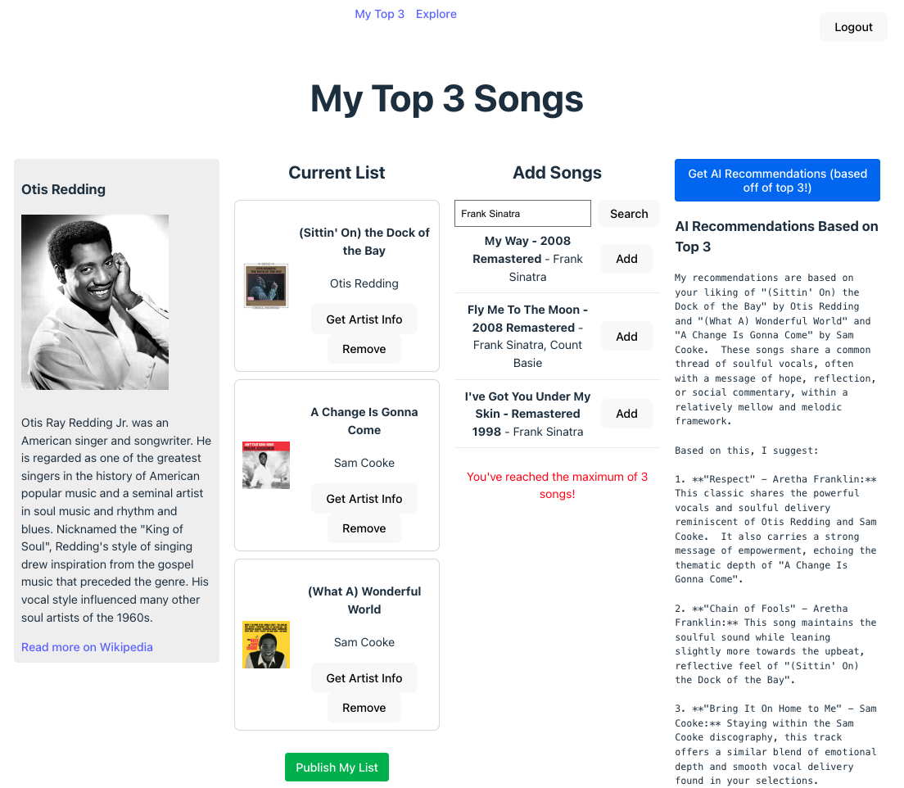
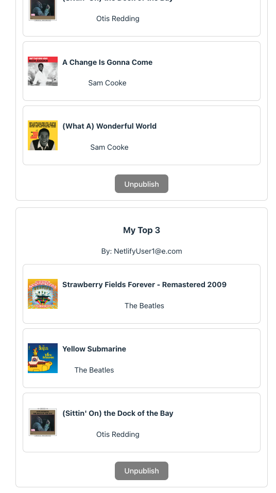

# 🎵 My Top 3 Song List App

This web app allows users to search for songs using Spotify, add their top 3 to a personal list, generate AI-powered recommendations, and fetch artist information.

---
# Available at https://sweet-stardust-eba547.netlify.app/
# My Top 3 Page

# Explore Page - Admin View (unpublish any users list button)

## 🧩 Project Breakdown

- Users register/log in and create their **Top 3 favorite songs** list.
- Uses the **Spotify API** for searching and retrieving song metadata.
- Taps into **Google Gemini AI** to suggest similar songs based on user's picks.
- Uses the **Wikipedia API** to fetch artist bios and images for display.
- Includes real-time updates (e.g. list publishing/unpublishing).
- Features user authentication and a shareable "Explore" section.

---

## 🔗 3 APIs:

### 1. **Spotify Web API**
- Used for song search and metadata like album image and artist name.

### 2. **Google Gemini API**
- Analyzes the user’s song list and returns smart recommendations based on mood, genre, or similarity.

### 3. **Wikipedia REST API**
- Fetches artist summaries, images, and article links using the artist name.
- This replaced the former lyrics APIs that was inconsistent.

---

## 🗃️ Database Management:

- **MongoDB Atlas** is used for:
  - Storing user profiles and authentication tokens
  - Saving user-created song lists (title, description, top 3 songs)
  - Managing publish/unpublish state of each list

---

## ⚙️ Backend Definition and Frameworks:

- **Node.js + Express.js**
  - Acts as a middle layer between frontend and APIs
  - Proxy routes for:
    - `/api/spotify` – handles Spotify token and search
    - `/api/gemini` – sends song list to Gemini and returns recommendations
    - `/api/wiki` – fetches Wikipedia artist info
    - `/api/lists` – handles list CRUD for MongoDB
    - `/api/auth` – user login/register using Firebase

- **Socket.IO**
  - Enables real-time updates when lists are published or changed

---

## 🚀 Deployment:

- **Frontend** deployed with **Vite + React** to **Netlify**
- **Backend** deployed on **Render.com**
- **MongoDB Atlas** handles cloud database
- Optional: Firebase Hosting or Vercel for frontend is also supported

